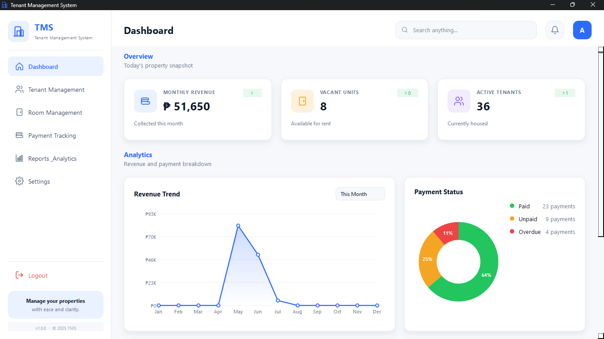

# Tenant Management System (TMS)

A desktop rental management app for landlords to handle tenants, rooms, and payments — built with **Python + PySide6** and backed by **SQLite**.

<p align="center">
  
</p>

---

## Quick Start

```bash
pip install pyside6
python main.py
```

**Demo login:** `admin` / `admin`

---

## Features

### Dashboard
At-a-glance summary cards for total tenants, available rooms, occupied rooms, and unpaid/overdue payments — plus a recent payment activity feed and occupancy updates.

### Tenant Management
Register tenants with name, contact number, birthdate, and sex. Assign them to available rooms during registration. Edit details and room assignments, or remove tenants (room occupancy updates automatically). Tenant history — past assignments and payment records — is preserved for future reference.

### Room Management
Create rooms with a room number, type (Solo, Bedspacer, Solo Deluxe, Bedspacer Deluxe), capacity, monthly rent, and deposit. Occupancy is tracked automatically — rooms are marked **Available**, **Partially Occupied**, or **Full**, and new assignments are blocked once capacity is reached.

### Payment Management
Record payments against a rental with a due date, payment date, amount, and type (Regular, Summer, Deposit, or Advance). Status is categorized automatically as **Paid**, **Unpaid**, or **Overdue**. Full payment history is kept per tenant, and individual records can be edited or deleted as needed.

### Search, Filter & Sort
Search across tenant names, IDs, room numbers, room types, contact numbers, payment status, and due dates. Filter by room availability, occupancy status, room type, or payment status. Sort records by move-in date, due date, monthly rent, capacity, room type, payment status, or tenant name. Tables update in real time after any add, edit, or delete action.

---

## Project Structure

```
Tenant_Management_System/
│
├── main.py                  ← Entry point; login ↔ shell switching
├── theme.py                 ← Design tokens (colours, radii, nav items)
├── icons.py                 ← SVG icon registry + make_icon() helper
│
├── data/
│   └── tms.db               ← SQLite database
│
├── database/
│   ├── db.py                ← Connection configuration
│   └── repositories.py      ← SQL queries and monthly aggregations
│
├── widgets/
│   ├── components.py        ← Cards, charts, badges, tables, buttons
│   └── navigation.py        ← Sidebar + top header
│
└── pages/
    ├── login.py
    ├── dashboard.py
    ├── tenants.py
    ├── rooms.py
    ├── payments.py
    ├── reports.py
    └── settings.py
```

---

## Design Tokens

| Token | Value | Use |
|---|---|---|
| `T.PRIMARY` | `#2C6BFF` | Buttons, active nav, links |
| `T.SUCCESS` | `#22C55E` | Paid status, positive deltas |
| `T.WARNING` | `#F5A524` | Unpaid, maintenance |
| `T.DANGER` | `#EF4444` | Overdue, delete actions |
| `T.BG` | `#F6F8FB` | Window / page background |
| `T.SURFACE` | `#FFFFFF` | Cards, panels |

All tokens live in `theme.py`.

---

## Requirements

- Python 3.10+
- PySide6 ≥ 6.6